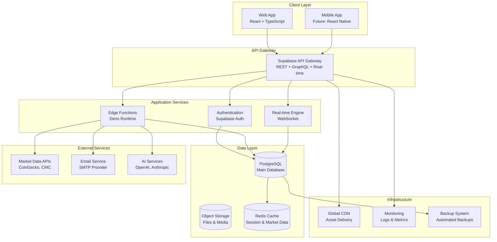
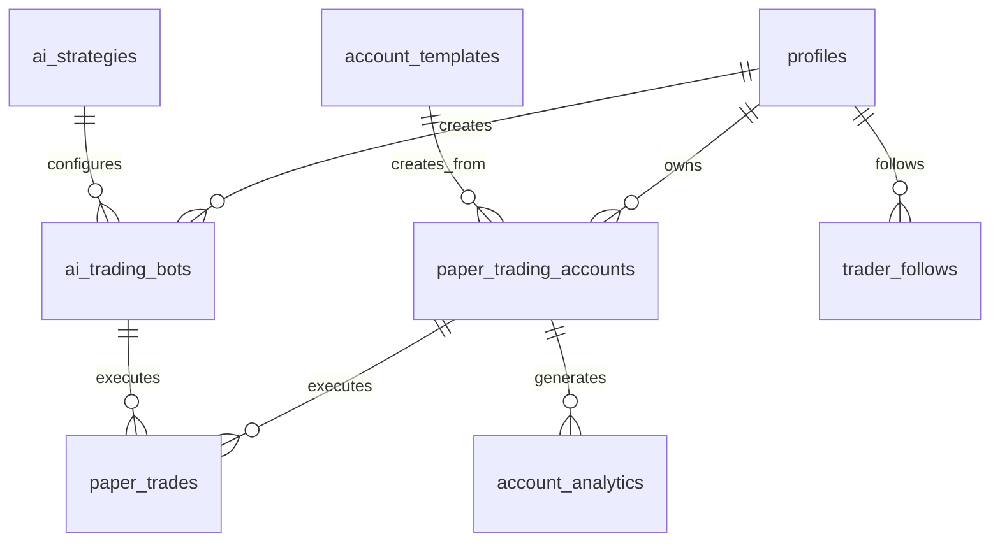
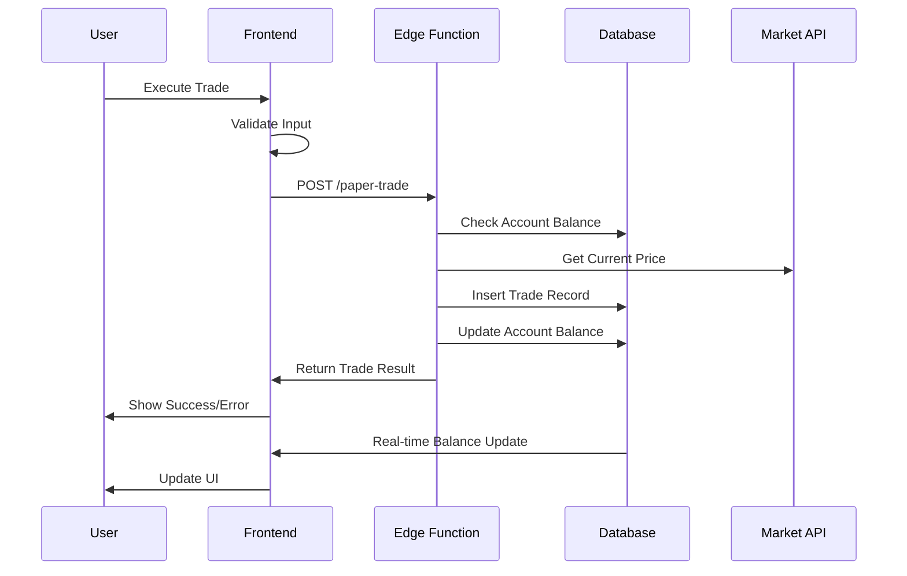
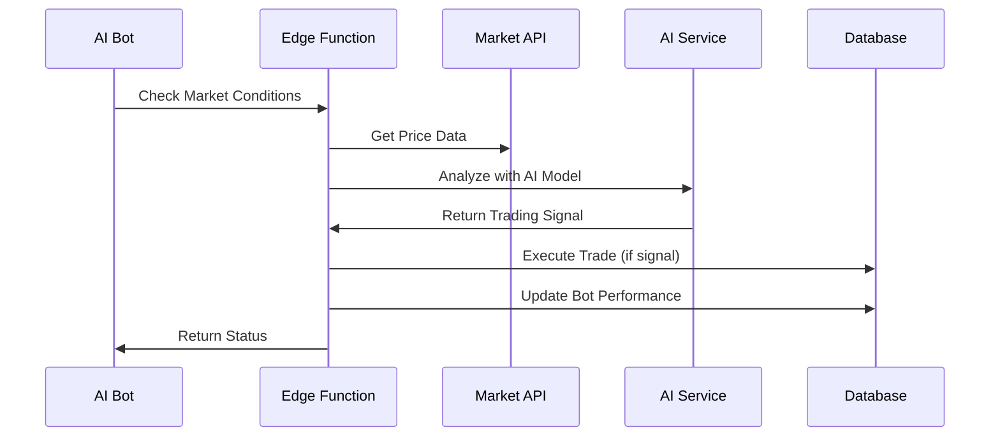

# Technical Architecture

## System Overview

CryptoTrader Pro is built on a modern, cloud-native architecture designed for scalability, real-time performance, and educational trading simulation. The platform leverages Supabase as the backend-as-a-service foundation with React/TypeScript for the frontend.

## Technology Stack

### Frontend Technologies
```typescript
// Core Framework
React 18.3.1              // Modern UI library with concurrent features
TypeScript 5.x             // Type-safe development
Vite 5.x                   // Fast build tool and dev server

// UI & Styling
Tailwind CSS 3.x           // Utility-first CSS framework
Shadcn/UI Components       // High-quality component library
Radix UI Primitives        // Accessible component foundations
Lucide React Icons         // Beautiful icon library

// State Management & Data
React Query (TanStack)     // Server state management
React Hooks               // Client state management
React Context             // Global state sharing

// Charts & Visualization
Recharts 2.x              // React chart library
React Three Fiber         // 3D graphics (future enhancement)

// Forms & Validation
React Hook Form           // Performant form handling
Zod                      // Schema validation
```

### Backend Infrastructure
```yaml
# Core Backend (Supabase)
Database: PostgreSQL 15+
Authentication: Supabase Auth (JWT-based)
Real-time: WebSocket subscriptions
Storage: Supabase Storage buckets
Edge Functions: Deno runtime

# External Services
Market Data: CoinGecko API, CoinMarketCap API
Email: Supabase SMTP integration
CDN: Supabase global CDN

# Development Tools
Version Control: Git
Hosting: Lovable.dev platform
CI/CD: Automatic deployments
Monitoring: Supabase built-in analytics
```

## System Architecture Diagram



## Component Architecture

### Frontend Component Hierarchy

```
src/
├── components/
│   ├── ui/                    # Base UI components (Shadcn)
│   │   ├── button.tsx
│   │   ├── card.tsx
│   │   ├── input.tsx
│   │   └── ...
│   ├── accounts/              # Account management
│   │   ├── MyAccounts.tsx
│   │   ├── AccountCreation.tsx
│   │   └── MultiAccountTrading.tsx
│   ├── trading/               # Trading components
│   │   ├── TradingPanel.tsx
│   │   ├── TradeExecution.tsx
│   │   └── OrderHistory.tsx
│   ├── analytics/             # Analytics & charts
│   │   ├── PerformanceCharts.tsx
│   │   ├── RiskMetrics.tsx
│   │   └── PortfolioBreakdown.tsx
│   ├── ai/                    # AI trading features
│   │   ├── AITradingBot.tsx
│   │   ├── StrategyBuilder.tsx
│   │   └── Backtesting.tsx
│   └── social/                # Social trading
│       ├── TraderLeaderboard.tsx
│       ├── FollowingManager.tsx
│       └── TradeCopying.tsx
├── hooks/                     # Custom React hooks
│   ├── useAuth.tsx
│   ├── useMultipleAccounts.tsx
│   ├── useRealTimeData.tsx
│   └── useTradingEngine.tsx
├── pages/                     # Route components
│   ├── Index.tsx
│   ├── Auth.tsx
│   └── NotFound.tsx
├── services/                  # External API services
│   ├── marketDataService.ts
│   ├── tradingService.ts
│   └── aiService.ts
└── lib/                       # Utilities
    ├── utils.ts
    ├── constants.ts
    └── types.ts
```

## Database Schema Design

### Core Tables Structure

```sql
-- User Management
profiles (id, email, display_name, created_at, updated_at)
user_settings (user_id, setting_name, setting_value)

-- Account Management
paper_trading_accounts (
  id, user_id, account_name, balance, initial_balance,
  total_pnl, account_type, risk_level, status,
  trading_strategy, color_theme, created_at
)

account_templates (
  id, name, description, account_type, risk_level,
  initial_balance, trading_strategy, is_public
)

-- Trading Engine
paper_trades (
  id, user_id, account_id, symbol, side, amount, price,
  total_value, fee, status, timestamp, trade_type
)

market_data_cache (
  symbol, price_usd, volume_24h, change_24h,
  last_updated, exchange
)

-- AI Trading
ai_trading_bots (
  id, user_id, name, strategy, status, config,
  performance, target_symbols, created_at
)

ai_strategies (
  id, user_id, name, description, model, prompt,
  parameters, is_active
)

-- Social Trading
trader_follows (
  id, user_id, trader_name, followed_at, is_active
)

-- Analytics
account_analytics (
  id, account_id, user_id, analytics_date,
  daily_return, sharpe_ratio, max_drawdown,
  total_trades, win_rate
)

portfolio_analytics (
  id, user_id, portfolio_id, total_return,
  volatility, profit_factor, analytics_data
)
```

### Database Relationships



## API Architecture

### REST API Endpoints

```typescript
// Authentication
POST /auth/signup              // User registration
POST /auth/signin              // User login
POST /auth/signout             // User logout
POST /auth/reset-password      // Password reset

// Account Management
GET    /api/accounts           // List user accounts
POST   /api/accounts           // Create new account
PUT    /api/accounts/:id       // Update account
DELETE /api/accounts/:id       // Delete account
POST   /api/accounts/:id/reset // Reset account balance

// Trading
POST /api/trades               // Execute paper trade
GET  /api/trades               // Get trade history
GET  /api/trades/:id           // Get specific trade

// Market Data
GET /api/market-data           // Current market prices
GET /api/market-data/history   // Historical price data
GET /api/market-data/symbols   // Available trading pairs

// AI Trading
GET    /api/ai-bots            // List AI bots
POST   /api/ai-bots            // Create/activate bot
PUT    /api/ai-bots/:id        // Update bot config
DELETE /api/ai-bots/:id        // Deactivate bot

// Social Trading
GET  /api/traders              // Top traders leaderboard
POST /api/traders/:id/follow   // Follow trader
POST /api/traders/:id/copy     // Enable trade copying

// Analytics
GET /api/analytics/account/:id // Account performance metrics
GET /api/analytics/portfolio   // Portfolio analytics
GET /api/analytics/risk        // Risk assessment
```

### Real-time Subscriptions

```typescript
// Market Data Subscriptions
supabase
  .channel('market-data')
  .on('postgres_changes', 
    { event: 'UPDATE', schema: 'public', table: 'market_data_cache' },
    (payload) => updatePrices(payload.new)
  )

// Portfolio Updates
supabase
  .channel('portfolio-updates')
  .on('postgres_changes',
    { event: '*', schema: 'public', table: 'paper_trades' },
    (payload) => updatePortfolio(payload)
  )

// Account Changes
supabase
  .channel('account-updates')
  .on('postgres_changes',
    { event: 'UPDATE', schema: 'public', table: 'paper_trading_accounts' },
    (payload) => syncAccountBalance(payload.new)
  )
```

## Data Flow Architecture

### Trading Flow



### AI Bot Flow



## Security Architecture

### Authentication & Authorization

```typescript
// Row Level Security (RLS) Policies
CREATE POLICY "Users can only access own accounts"
ON paper_trading_accounts
FOR ALL USING (auth.uid() = user_id);

CREATE POLICY "Users can only view own trades"
ON paper_trades
FOR SELECT USING (auth.uid() = user_id);

// API Security
// All requests require valid JWT token
// Supabase automatically validates tokens
// RLS prevents unauthorized data access
```

### Data Protection

```sql
-- Encryption at rest (automatic with Supabase)
-- All sensitive data encrypted using AES-256

-- API Security
-- Rate limiting: 100 requests/minute per user
-- Input validation on all endpoints
-- SQL injection prevention via parameterized queries
-- XSS protection via content sanitization
```

## Performance Optimization

### Frontend Performance

```typescript
// Code Splitting
const TradingPanel = lazy(() => import('./TradingPanel'));
const AITradingBot = lazy(() => import('./AITradingBot'));

// Memoization
const MemoizedChart = memo(PerformanceChart);
const memoizedPriceCalculation = useMemo(() => 
  calculatePortfolioValue(holdings, prices), [holdings, prices]
);

// Debouncing
const debouncedSearch = useDebounce(searchTerm, 300);
```

### Database Performance

```sql
-- Indexes for fast queries
CREATE INDEX idx_paper_trades_user_account 
ON paper_trades(user_id, account_id);

CREATE INDEX idx_market_data_symbol_updated 
ON market_data_cache(symbol, last_updated);

-- Materialized views for analytics
CREATE MATERIALIZED VIEW account_performance_summary AS
SELECT 
  account_id,
  SUM(total_value) as total_volume,
  COUNT(*) as trade_count,
  AVG(CASE WHEN side = 'buy' AND total_value > 0 THEN 1 ELSE 0 END) as win_rate
FROM paper_trades
GROUP BY account_id;
```

## Scalability Considerations

### Horizontal Scaling
- **Supabase Auto-scaling**: Automatic database scaling based on load
- **CDN Distribution**: Global content delivery via Supabase CDN
- **Edge Functions**: Serverless scaling for trade execution
- **Connection Pooling**: Efficient database connection management

### Vertical Scaling
- **Database Upgrades**: Seamless Supabase plan upgrades
- **Compute Resources**: Elastic compute scaling
- **Storage Scaling**: Unlimited storage with Supabase
- **Memory Optimization**: Efficient data structures and caching

### Caching Strategy
```typescript
// Redis caching for market data
const cachedPrice = await redis.get(`price:${symbol}`);
if (!cachedPrice) {
  const price = await fetchFromAPI(symbol);
  await redis.setex(`price:${symbol}`, 60, price);
}

// Browser caching for static assets
// Service worker for offline functionality
```

## Monitoring & Observability

### Application Monitoring
```typescript
// Error tracking
try {
  await executeTrade(tradeData);
} catch (error) {
  logger.error('Trade execution failed', {
    error: error.message,
    userId: user.id,
    tradeData: sanitizeTradeData(tradeData)
  });
  throw error;
}

// Performance monitoring
const start = performance.now();
await processData();
const duration = performance.now() - start;
metrics.timing('data_processing_duration', duration);
```

### Database Monitoring
- **Query Performance**: Automatic slow query detection
- **Connection Monitoring**: Real-time connection pool status
- **Storage Usage**: Automated storage monitoring and alerts
- **Replication Lag**: Multi-region replication monitoring

## Deployment Architecture

### Environment Strategy
```yaml
# Development
Environment: Local development
Database: Local Supabase instance
Real-time: Disabled for development
AI Services: Mock responses

# Staging
Environment: Staging/Preview
Database: Supabase staging project
Real-time: Enabled
AI Services: Test API keys

# Production
Environment: Production
Database: Supabase production project
Real-time: Fully enabled
AI Services: Production API keys
CDN: Global distribution
Monitoring: Full observability
```

### CI/CD Pipeline
```yaml
# Automated deployment on Lovable.dev
on:
  push:
    branches: [main]
steps:
  - Checkout code
  - Install dependencies
  - Run tests
  - Build application
  - Deploy to production
  - Run smoke tests
  - Notify team
```

---

*This technical architecture provides the foundation for a scalable, secure, and maintainable cryptocurrency trading education platform.*