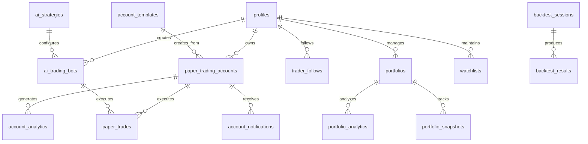

# Database Schema

## Overview
This document provides a comprehensive overview of the database schema for CryptoTrader Pro, built on PostgreSQL through Supabase.

## Entity Relationship Diagram (ERD)



## Core Tables

### User Management

#### profiles
```sql
CREATE TABLE profiles (
  id UUID PRIMARY KEY REFERENCES auth.users(id) ON DELETE CASCADE,
  email TEXT UNIQUE NOT NULL,
  display_name TEXT,
  avatar_url TEXT,
  paper_balance NUMERIC DEFAULT 100000.00,
  created_at TIMESTAMPTZ DEFAULT NOW(),
  updated_at TIMESTAMPTZ DEFAULT NOW()
);
```

**Indexes:**
- PRIMARY KEY on `id`
- UNIQUE INDEX on `email`

**RLS Policies:**
- Users can only access their own profile data

#### user_settings
```sql
CREATE TABLE user_settings (
  id UUID PRIMARY KEY DEFAULT gen_random_uuid(),
  user_id UUID NOT NULL REFERENCES profiles(id) ON DELETE CASCADE,
  setting_name TEXT NOT NULL,
  setting_value JSONB,
  created_at TIMESTAMPTZ DEFAULT NOW(),
  updated_at TIMESTAMPTZ DEFAULT NOW(),
  UNIQUE(user_id, setting_name)
);
```

### Account Management

#### paper_trading_accounts
```sql
CREATE TABLE paper_trading_accounts (
  id UUID PRIMARY KEY DEFAULT gen_random_uuid(),
  user_id UUID NOT NULL,
  account_name TEXT NOT NULL,
  account_type account_type_enum DEFAULT 'balanced',
  risk_level risk_level_enum DEFAULT 'medium',
  balance NUMERIC DEFAULT 100000.00,
  initial_balance NUMERIC DEFAULT 100000.00,
  total_pnl NUMERIC DEFAULT 0.00,
  total_pnl_percentage NUMERIC DEFAULT 0.00,
  max_daily_loss NUMERIC DEFAULT 1000.00,
  max_position_size NUMERIC DEFAULT 5000.00,
  trading_strategy TEXT DEFAULT 'manual',
  color_theme VARCHAR(7) DEFAULT '#3b82f6',
  icon VARCHAR(50) DEFAULT 'TrendingUp',
  tags TEXT[] DEFAULT '{}',
  description TEXT,
  status account_status_enum DEFAULT 'active',
  is_default BOOLEAN DEFAULT FALSE,
  last_accessed TIMESTAMPTZ DEFAULT NOW(),
  access_count INTEGER DEFAULT 0,
  created_at TIMESTAMPTZ DEFAULT NOW(),
  updated_at TIMESTAMPTZ DEFAULT NOW()
);
```

**Indexes:**
- PRIMARY KEY on `id`
- INDEX on `user_id`
- INDEX on `account_type`
- INDEX on `status`
- INDEX on `is_default`

#### account_templates
```sql
CREATE TABLE account_templates (
  id UUID PRIMARY KEY DEFAULT gen_random_uuid(),
  name VARCHAR(100) NOT NULL,
  description TEXT,
  account_type account_type_enum NOT NULL,
  risk_level risk_level_enum NOT NULL,
  initial_balance NUMERIC NOT NULL DEFAULT 100000.00,
  max_daily_loss NUMERIC DEFAULT 1000.00,
  max_position_size NUMERIC DEFAULT 5000.00,
  trading_strategy TEXT DEFAULT 'manual',
  color_theme VARCHAR(7) DEFAULT '#3b82f6',
  icon VARCHAR(50) DEFAULT 'TrendingUp',
  tags TEXT[] DEFAULT '{}',
  is_public BOOLEAN DEFAULT TRUE,
  created_by UUID,
  usage_count INTEGER DEFAULT 0,
  rating NUMERIC DEFAULT 0,
  created_at TIMESTAMPTZ DEFAULT NOW(),
  updated_at TIMESTAMPTZ DEFAULT NOW()
);
```

### Trading Engine

#### paper_trades
```sql
CREATE TABLE paper_trades (
  id UUID PRIMARY KEY DEFAULT gen_random_uuid(),
  user_id UUID NOT NULL,
  account_id UUID,
  bot_id UUID,
  symbol TEXT NOT NULL,
  side TEXT NOT NULL CHECK (side IN ('buy', 'sell')),
  amount NUMERIC NOT NULL DEFAULT 0,
  price NUMERIC NOT NULL DEFAULT 0,
  execution_price NUMERIC DEFAULT 0,
  total_value NUMERIC NOT NULL DEFAULT 0,
  fee NUMERIC NOT NULL DEFAULT 0,
  trade_type TEXT DEFAULT 'market',
  order_type TEXT DEFAULT 'market',
  status TEXT NOT NULL DEFAULT 'completed',
  risk_score NUMERIC DEFAULT 0,
  confidence_level NUMERIC DEFAULT 50,
  stop_loss NUMERIC,
  take_profit NUMERIC,
  execution_time_ms INTEGER DEFAULT 0,
  reasoning TEXT,
  trade_category VARCHAR(50) DEFAULT 'manual',
  tags TEXT[] DEFAULT '{}',
  notes TEXT,
  timestamp TIMESTAMPTZ NOT NULL DEFAULT NOW(),
  created_at TIMESTAMPTZ NOT NULL DEFAULT NOW()
);
```

**Indexes:**
- PRIMARY KEY on `id`
- INDEX on `user_id`
- INDEX on `account_id`
- INDEX on `bot_id`
- INDEX on `symbol`
- INDEX on `side`
- INDEX on `created_at`
- COMPOSITE INDEX on `(user_id, account_id)`

#### market_data_cache
```sql
CREATE TABLE market_data_cache (
  id UUID PRIMARY KEY DEFAULT gen_random_uuid(),
  symbol TEXT NOT NULL,
  name TEXT,
  price_usd NUMERIC NOT NULL,
  price_aud NUMERIC NOT NULL,
  volume_24h_usd NUMERIC,
  volume_24h_aud NUMERIC,
  change_24h NUMERIC,
  change_percentage_24h NUMERIC,
  market_cap_usd NUMERIC,
  market_cap_aud NUMERIC,
  high_24h NUMERIC,
  low_24h NUMERIC,
  exchange TEXT NOT NULL DEFAULT 'coingecko',
  last_updated TIMESTAMPTZ DEFAULT NOW()
);
```

**Indexes:**
- PRIMARY KEY on `id`
- UNIQUE INDEX on `symbol`
- INDEX on `last_updated`

### AI Trading System

#### ai_trading_bots
```sql
CREATE TABLE ai_trading_bots (
  id UUID PRIMARY KEY DEFAULT gen_random_uuid(),
  user_id UUID NOT NULL,
  name TEXT NOT NULL,
  strategy TEXT NOT NULL,
  ai_model TEXT NOT NULL DEFAULT 'deepseek-r1',
  target_symbols TEXT[] NOT NULL,
  status bot_status_enum DEFAULT 'paused',
  mode trading_mode_enum DEFAULT 'paper',
  paper_balance NUMERIC DEFAULT 10000.00,
  max_position_size NUMERIC DEFAULT 1000.00,
  risk_level risk_level_enum DEFAULT 'medium',
  config JSONB DEFAULT '{}',
  performance JSONB DEFAULT '{}',
  last_trade_at TIMESTAMPTZ,
  created_at TIMESTAMPTZ DEFAULT NOW(),
  updated_at TIMESTAMPTZ DEFAULT NOW()
);
```

#### ai_strategies
```sql
CREATE TABLE ai_strategies (
  id UUID PRIMARY KEY DEFAULT gen_random_uuid(),
  user_id UUID NOT NULL,
  name TEXT NOT NULL,
  description TEXT,
  model TEXT NOT NULL DEFAULT 'gpt-4o-mini',
  prompt TEXT NOT NULL,
  parameters JSONB NOT NULL DEFAULT '{}',
  indicators TEXT[] DEFAULT '{}',
  market_data_sources TEXT[] DEFAULT '{}',
  is_active BOOLEAN DEFAULT FALSE,
  created_at TIMESTAMPTZ DEFAULT NOW(),
  updated_at TIMESTAMPTZ DEFAULT NOW()
);
```

### Social Trading

#### trader_follows
```sql
CREATE TABLE trader_follows (
  id UUID PRIMARY KEY DEFAULT gen_random_uuid(),
  user_id UUID NOT NULL,
  trader_name TEXT NOT NULL,
  trader_category TEXT NOT NULL DEFAULT 'Other',
  follower_id UUID,
  followed_id UUID,
  copy_trading_enabled BOOLEAN DEFAULT FALSE,
  allocation_percentage NUMERIC DEFAULT 0,
  followed_at TIMESTAMPTZ NOT NULL DEFAULT NOW(),
  is_active BOOLEAN NOT NULL DEFAULT TRUE,
  created_at TIMESTAMPTZ NOT NULL DEFAULT NOW(),
  updated_at TIMESTAMPTZ NOT NULL DEFAULT NOW()
);
```

### Portfolio Management

#### portfolios
```sql
CREATE TABLE portfolios (
  id UUID PRIMARY KEY DEFAULT gen_random_uuid(),
  user_id UUID NOT NULL,
  name TEXT NOT NULL DEFAULT 'My Portfolio',
  mode trading_mode_enum DEFAULT 'paper',
  initial_balance NUMERIC DEFAULT 10000.00,
  current_balance NUMERIC DEFAULT 10000.00,
  total_value NUMERIC DEFAULT 10000.00,
  total_pnl NUMERIC DEFAULT 0.00,
  total_pnl_percentage NUMERIC DEFAULT 0.00,
  positions JSONB DEFAULT '{}',
  is_default BOOLEAN DEFAULT FALSE,
  created_at TIMESTAMPTZ DEFAULT NOW(),
  updated_at TIMESTAMPTZ DEFAULT NOW()
);
```

#### portfolio_snapshots
```sql
CREATE TABLE portfolio_snapshots (
  id UUID PRIMARY KEY DEFAULT gen_random_uuid(),
  user_id UUID NOT NULL,
  portfolio_id UUID NOT NULL,
  snapshot_date DATE NOT NULL,
  total_value NUMERIC NOT NULL,
  pnl_daily NUMERIC DEFAULT 0,
  pnl_percentage NUMERIC DEFAULT 0,
  positions_snapshot JSONB DEFAULT '{}',
  created_at TIMESTAMPTZ DEFAULT NOW(),
  UNIQUE(portfolio_id, snapshot_date)
);
```

### Analytics

#### account_analytics
```sql
CREATE TABLE account_analytics (
  id UUID PRIMARY KEY DEFAULT gen_random_uuid(),
  account_id UUID NOT NULL,
  user_id UUID NOT NULL,
  analytics_date DATE NOT NULL DEFAULT CURRENT_DATE,
  daily_return NUMERIC DEFAULT 0,
  weekly_return NUMERIC DEFAULT 0,
  monthly_return NUMERIC DEFAULT 0,
  quarterly_return NUMERIC DEFAULT 0,
  yearly_return NUMERIC DEFAULT 0,
  volatility NUMERIC DEFAULT 0,
  sharpe_ratio NUMERIC DEFAULT 0,
  sortino_ratio NUMERIC DEFAULT 0,
  max_drawdown NUMERIC DEFAULT 0,
  current_drawdown NUMERIC DEFAULT 0,
  total_trades INTEGER DEFAULT 0,
  winning_trades INTEGER DEFAULT 0,
  losing_trades INTEGER DEFAULT 0,
  win_rate NUMERIC DEFAULT 0,
  avg_win NUMERIC DEFAULT 0,
  avg_loss NUMERIC DEFAULT 0,
  profit_factor NUMERIC DEFAULT 0,
  active_positions INTEGER DEFAULT 0,
  largest_position NUMERIC DEFAULT 0,
  portfolio_diversity NUMERIC DEFAULT 0,
  cash_percentage NUMERIC DEFAULT 100,
  benchmark_return NUMERIC DEFAULT 0,
  alpha NUMERIC DEFAULT 0,
  beta NUMERIC DEFAULT 1,
  correlation NUMERIC DEFAULT 0,
  custom_metrics JSONB DEFAULT '{}',
  created_at TIMESTAMPTZ DEFAULT NOW(),
  updated_at TIMESTAMPTZ DEFAULT NOW()
);
```

### Notifications & Alerts

#### account_notifications
```sql
CREATE TABLE account_notifications (
  id UUID PRIMARY KEY DEFAULT gen_random_uuid(),
  account_id UUID NOT NULL,
  user_id UUID NOT NULL,
  notification_type VARCHAR(50) NOT NULL,
  title VARCHAR(200) NOT NULL,
  message TEXT NOT NULL,
  severity VARCHAR(20) DEFAULT 'info',
  is_read BOOLEAN DEFAULT FALSE,
  metadata JSONB DEFAULT '{}',
  expires_at TIMESTAMPTZ,
  created_at TIMESTAMPTZ DEFAULT NOW()
);
```

#### risk_alerts
```sql
CREATE TABLE risk_alerts (
  id UUID PRIMARY KEY DEFAULT gen_random_uuid(),
  user_id UUID NOT NULL,
  alert_type TEXT NOT NULL,
  symbol TEXT,
  trigger_condition TEXT NOT NULL,
  trigger_value NUMERIC,
  current_value NUMERIC,
  bot_id UUID,
  portfolio_id UUID,
  status TEXT DEFAULT 'active',
  alert_config JSONB DEFAULT '{}',
  triggered_at TIMESTAMPTZ,
  created_at TIMESTAMPTZ DEFAULT NOW(),
  updated_at TIMESTAMPTZ DEFAULT NOW()
);
```

### Backtesting

#### backtest_sessions
```sql
CREATE TABLE backtest_sessions (
  id UUID PRIMARY KEY DEFAULT gen_random_uuid(),
  user_id UUID NOT NULL,
  session_name TEXT NOT NULL,
  symbol TEXT NOT NULL,
  timeframe TEXT DEFAULT '1h',
  strategy_id UUID,
  bot_id UUID,
  start_date TIMESTAMPTZ NOT NULL,
  end_date TIMESTAMPTZ NOT NULL,
  initial_capital NUMERIC DEFAULT 10000,
  final_capital NUMERIC DEFAULT 0,
  total_trades INTEGER DEFAULT 0,
  winning_trades INTEGER DEFAULT 0,
  losing_trades INTEGER DEFAULT 0,
  win_rate NUMERIC DEFAULT 0,
  profit_factor NUMERIC DEFAULT 0,
  max_drawdown NUMERIC DEFAULT 0,
  sharpe_ratio NUMERIC DEFAULT 0,
  sortino_ratio NUMERIC DEFAULT 0,
  calmar_ratio NUMERIC DEFAULT 0,
  backtest_config JSONB DEFAULT '{}',
  results_data JSONB DEFAULT '{}',
  equity_curve JSONB DEFAULT '[]',
  trade_history JSONB DEFAULT '[]',
  status TEXT DEFAULT 'pending',
  completed_at TIMESTAMPTZ,
  created_at TIMESTAMPTZ DEFAULT NOW()
);
```

### Audit & Logging

#### audit_logs
```sql
CREATE TABLE audit_logs (
  id UUID PRIMARY KEY DEFAULT gen_random_uuid(),
  user_id UUID,
  action TEXT NOT NULL,
  resource_type TEXT,
  resource_id TEXT,
  details JSONB DEFAULT '{}',
  ip_address INET,
  user_agent TEXT,
  timestamp TIMESTAMPTZ DEFAULT NOW()
);
```

#### paper_account_audit
```sql
CREATE TABLE paper_account_audit (
  id UUID PRIMARY KEY DEFAULT gen_random_uuid(),
  user_id UUID NOT NULL,
  account_id UUID NOT NULL,
  action TEXT NOT NULL,
  old_balance NUMERIC,
  new_balance NUMERIC,
  amount_changed NUMERIC,
  reason TEXT,
  metadata JSONB DEFAULT '{}',
  created_at TIMESTAMPTZ DEFAULT NOW()
);
```

## Custom Types (Enums)

```sql
-- Account Types
CREATE TYPE account_type_enum AS ENUM (
  'conservative', 'balanced', 'aggressive', 'day_trading', 'swing_trading'
);

-- Risk Levels
CREATE TYPE risk_level_enum AS ENUM (
  'very_low', 'low', 'medium', 'high', 'very_high', 'aggressive'
);

-- Account Status
CREATE TYPE account_status_enum AS ENUM (
  'active', 'paused', 'archived', 'suspended'
);

-- Bot Status
CREATE TYPE bot_status_enum AS ENUM (
  'active', 'paused', 'stopped', 'error'
);

-- Trading Mode
CREATE TYPE trading_mode_enum AS ENUM (
  'paper', 'live'
);
```

## Database Functions

### Key Functions

#### handle_new_user()
Automatically creates default portfolio and account when user signs up.

#### execute_paper_trade()
Handles paper trade execution with validation and balance updates.

#### reset_paper_account()
Resets account to initial balance with audit logging.

#### calculate_account_metrics()
Calculates comprehensive performance metrics for accounts.

#### create_account_from_template()
Creates new account based on predefined templates.

## Migration Scripts

### Initial Setup
```bash
# Run migrations in order
supabase migration up

# Seed initial data
psql -f seed_data.sql
```

### Backup Instructions
```bash
# Create backup
pg_dump -h hostname -U username -d database_name > backup.sql

# Restore backup
psql -h hostname -U username -d database_name < backup.sql
```

## Row Level Security (RLS)

All tables implement comprehensive RLS policies ensuring:
- Users can only access their own data
- Proper isolation between user accounts
- Admin users have appropriate elevated permissions
- Public data (market data, templates) is accessible to all

## Performance Optimizations

### Indexes
- All foreign keys are indexed
- Composite indexes on frequently queried combinations
- Partial indexes for filtered queries
- BTREE indexes for range queries

### Partitioning
- Large tables are partitioned by date where appropriate
- Trade history partitioned by month
- Analytics data partitioned by quarter

### Connection Pooling
- Supabase handles connection pooling automatically
- Max connections configured based on plan limits