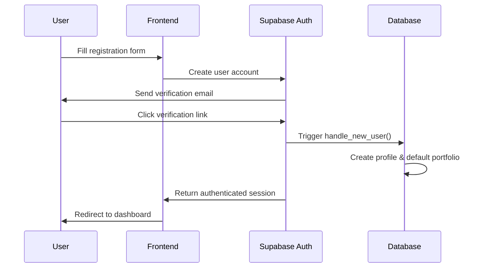
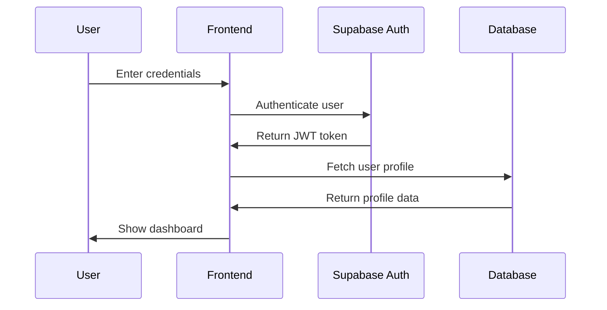
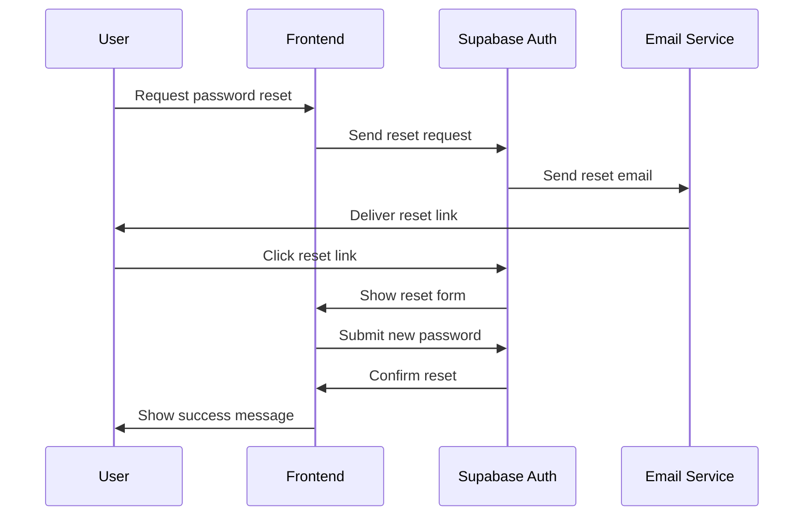

# Authentication & Security

## Overview
CryptoTrader Pro implements a comprehensive security architecture built on Supabase Auth with additional layers of protection for financial data and trading operations.

## Authentication Methods

### Email & Password Authentication
- **Primary Method**: Email/password authentication via Supabase Auth
- **Email Verification**: Required for all new accounts
- **Password Requirements**: 
  - Minimum 8 characters
  - Mix of uppercase, lowercase, numbers
  - Special characters recommended
- **Password Reset**: Secure reset flow with email verification

### Social Authentication (Future)
```typescript
// OAuth providers (planned)
const providers = [
  'google',
  'github',
  'discord'
];
```

### Multi-Factor Authentication (Planned)
- TOTP (Time-based One-Time Password)
- SMS verification for high-value operations
- Hardware key support (FIDO2/WebAuthn)

## User Flow Diagrams

### Registration Flow


### Login Flow


### Password Reset Flow


## Role-Based Access Control (RBAC)

### User Roles
```sql
CREATE TYPE app_role AS ENUM ('user', 'admin', 'moderator');

CREATE TABLE user_roles (
  id UUID PRIMARY KEY DEFAULT gen_random_uuid(),
  user_id UUID REFERENCES auth.users(id) ON DELETE CASCADE NOT NULL,
  role app_role NOT NULL,
  granted_by UUID REFERENCES auth.users(id),
  granted_at TIMESTAMPTZ DEFAULT NOW(),
  UNIQUE (user_id, role)
);
```

### Role Permissions
- **User**: Standard trading operations, account management
- **Moderator**: Community management, content moderation
- **Admin**: Full system access, user management, analytics

### Permission Checking
```typescript
// Security definer function to check roles
CREATE OR REPLACE FUNCTION has_role(_user_id UUID, _role app_role)
RETURNS BOOLEAN
LANGUAGE SQL
STABLE
SECURITY DEFINER
AS $$
  SELECT EXISTS (
    SELECT 1 FROM user_roles
    WHERE user_id = _user_id AND role = _role
  )
$$;
```

## Row Level Security (RLS)

### Core Principles
1. **Data Isolation**: Users can only access their own data
2. **Least Privilege**: Minimal required permissions
3. **Defense in Depth**: Multiple security layers

### Key RLS Policies

#### User Profiles
```sql
-- Users can only access their own profile
CREATE POLICY "Users can view own profile"
ON profiles FOR ALL
USING (auth.uid() = id);
```

#### Trading Accounts
```sql
-- Users can only access their own trading accounts
CREATE POLICY "Users can manage own accounts"
ON paper_trading_accounts FOR ALL
USING (auth.uid() = user_id);
```

#### Trading Data
```sql
-- Users can only see their own trades
CREATE POLICY "Users can view own trades"
ON paper_trades FOR SELECT
USING (auth.uid() = user_id);

-- Users can only create trades for their accounts
CREATE POLICY "Users can create own trades"
ON paper_trades FOR INSERT
WITH CHECK (
  auth.uid() = user_id AND
  EXISTS (
    SELECT 1 FROM paper_trading_accounts
    WHERE id = account_id AND user_id = auth.uid()
  )
);
```

#### AI Bots
```sql
-- Users can only manage their own bots
CREATE POLICY "Users can manage own bots"
ON ai_trading_bots FOR ALL
USING (auth.uid() = user_id);
```

#### Public Data
```sql
-- Market data is publicly readable
CREATE POLICY "Market data is public"
ON market_data_cache FOR SELECT
USING (true);

-- Account templates are publicly readable
CREATE POLICY "Public templates are readable"
ON account_templates FOR SELECT
USING (is_public = true OR auth.uid() = created_by);
```

## API Security

### Authentication Headers
```typescript
// All API requests require valid JWT
const headers = {
  'Authorization': `Bearer ${session.access_token}`,
  'Content-Type': 'application/json'
};
```

### Request Validation
```typescript
// Input validation schema
const tradeSchema = z.object({
  symbol: z.string().min(1).max(10),
  side: z.enum(['buy', 'sell']),
  amount: z.number().positive().max(1000000),
  account_id: z.string().uuid()
});
```

### Rate Limiting
- **Supabase Built-in**: 100 requests/minute per user
- **Trading Operations**: 10 trades/minute per account
- **Bot Operations**: 1 action/second per bot

## Data Protection

### Encryption at Rest
- **Database**: AES-256 encryption (Supabase managed)
- **Storage**: Encrypted file storage for documents
- **Secrets**: Vault-encrypted API keys and sensitive data

### Encryption in Transit
- **HTTPS**: All communications over TLS 1.3
- **WebSocket**: Secure WebSocket connections (WSS)
- **API Calls**: End-to-end encryption for sensitive operations

### Sensitive Data Handling
```typescript
// Never log sensitive data
const logSafeTradeData = (trade) => ({
  id: trade.id,
  symbol: trade.symbol,
  side: trade.side,
  // amount excluded for privacy
  timestamp: trade.timestamp
});
```

## Session Management

### JWT Token Handling
```typescript
// Automatic token refresh
supabase.auth.onAuthStateChange((event, session) => {
  if (event === 'TOKEN_REFRESHED') {
    // Handle refreshed token
    updateAuthHeaders(session.access_token);
  }
});
```

### Session Security
- **Expiration**: 1 hour access tokens, 30-day refresh tokens
- **Rotation**: Automatic token rotation
- **Revocation**: Immediate session termination on logout
- **Device Tracking**: Track active sessions per user

## Password Security

### Password Policies
```typescript
const passwordRequirements = {
  minLength: 8,
  requireUppercase: true,
  requireLowercase: true,
  requireNumbers: true,
  requireSpecialChars: false, // recommended but not required
  preventCommonPasswords: true,
  preventUserInfoInPassword: true
};
```

### Password Reset Security
- **Time-limited Links**: 15-minute expiration
- **Single Use**: Links invalidated after use
- **Rate Limiting**: 3 attempts per hour per email
- **Audit Logging**: All reset attempts logged

## API Key Management

### External API Keys
```sql
-- Encrypted storage of API keys
CREATE TABLE api_credentials (
  id UUID PRIMARY KEY DEFAULT gen_random_uuid(),
  user_id UUID NOT NULL REFERENCES auth.users(id),
  service_name TEXT NOT NULL,
  encrypted_key TEXT NOT NULL,
  created_at TIMESTAMPTZ DEFAULT NOW(),
  last_used TIMESTAMPTZ,
  is_active BOOLEAN DEFAULT TRUE
);
```

### Key Rotation
- **Automatic**: Monthly rotation for system keys
- **Manual**: User-triggered rotation for personal keys
- **Emergency**: Immediate revocation capability

## DDoS Prevention

### Rate Limiting Strategy
```typescript
// Tiered rate limiting
const rateLimits = {
  authentication: '5/minute',
  trading: '10/minute',
  data_fetch: '100/minute',
  general_api: '60/minute'
};
```

### Protection Measures
- **CloudFlare**: DDoS protection at edge
- **Supabase**: Built-in rate limiting
- **Application Level**: Custom throttling for sensitive operations

## Security Monitoring

### Audit Logging
```sql
-- Comprehensive audit trail
INSERT INTO audit_logs (
  user_id,
  action,
  resource_type,
  resource_id,
  details,
  ip_address,
  user_agent
) VALUES (
  auth.uid(),
  'TRADE_EXECUTED',
  'paper_trade',
  trade_id,
  jsonb_build_object('symbol', symbol, 'amount', amount),
  inet_client_addr(),
  current_setting('request.headers')::json->>'user-agent'
);
```

### Security Events
- **Failed Login Attempts**: Track and alert on suspicious activity
- **Unusual Trading Patterns**: Monitor for anomalous behavior
- **API Abuse**: Detect and prevent automated attacks
- **Data Access Patterns**: Monitor for unauthorized access attempts

### Incident Response
1. **Detection**: Automated monitoring and alerting
2. **Assessment**: Evaluate severity and impact
3. **Containment**: Isolate affected systems/users
4. **Eradication**: Remove threat and vulnerabilities
5. **Recovery**: Restore normal operations
6. **Lessons Learned**: Update security measures

## Compliance & Standards

### Data Privacy
- **GDPR Compliance**: Data portability and deletion rights
- **CCPA Compliance**: Consumer privacy rights
- **Data Minimization**: Collect only necessary data
- **Retention Policies**: Automatic data cleanup

### Financial Regulations
- **Paper Trading Disclaimer**: Clear risk warnings
- **No Real Money**: Strictly educational platform
- **Data Protection**: Financial data security standards
- **Audit Trail**: Comprehensive transaction logging

## Security Checklist

### Development Security
- [ ] Input validation on all endpoints
- [ ] SQL injection prevention
- [ ] XSS protection measures
- [ ] CSRF token implementation
- [ ] Secure headers configuration
- [ ] Dependency vulnerability scanning

### Deployment Security
- [ ] HTTPS enforcement
- [ ] Security headers configured
- [ ] Database encryption enabled
- [ ] Backup encryption verified
- [ ] Access logs enabled
- [ ] Monitoring alerts configured

### Operational Security
- [ ] Regular security audits
- [ ] Penetration testing
- [ ] Security training for team
- [ ] Incident response plan tested
- [ ] Backup recovery verified
- [ ] Access reviews conducted

## Emergency Procedures

### Account Compromise
1. Immediately revoke all sessions
2. Force password reset
3. Review and log all recent activity
4. Check for unauthorized trades or changes
5. Notify user via secure channel

### Data Breach Response
1. Assess scope and impact
2. Contain the breach
3. Notify affected users within 24 hours
4. Report to relevant authorities if required
5. Implement additional security measures
6. Conduct post-incident review

### System Compromise
1. Isolate affected systems
2. Assess damage and data exposure
3. Implement emergency access controls
4. Restore from clean backups
5. Update all credentials and keys
6. Conduct forensic analysis