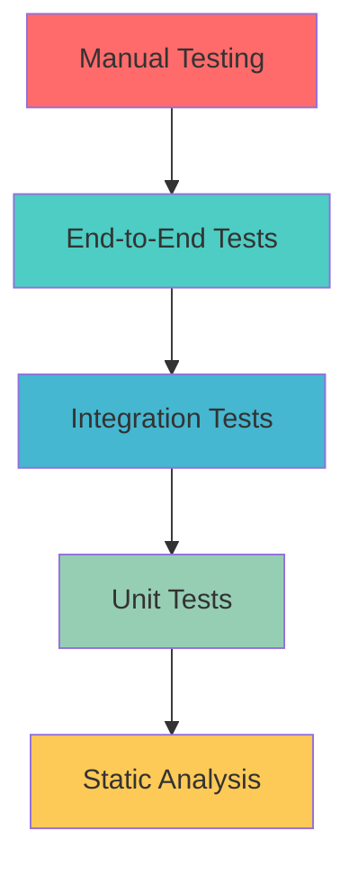

# Testing Strategy

## Overview
This document outlines the comprehensive testing strategy for CryptoTrader Pro, covering automated testing, manual testing procedures, and quality assurance practices.

## Testing Pyramid



### Testing Levels

#### 1. Unit Tests (Foundation - 70%)
- **Scope**: Individual functions, components, hooks
- **Tools**: Jest, React Testing Library
- **Coverage Target**: >80%
- **Speed**: Fast (<1s per test)

#### 2. Integration Tests (Core - 20%)
- **Scope**: Component interactions, API integrations
- **Tools**: Jest, MSW (Mock Service Worker)
- **Coverage Target**: Critical user flows
- **Speed**: Medium (1-10s per test)

#### 3. End-to-End Tests (Top - 10%)
- **Scope**: Complete user journeys
- **Tools**: Playwright, Cypress
- **Coverage Target**: Happy paths + critical errors
- **Speed**: Slow (10s-1min per test)

## Testing Tools & Libraries

### Core Testing Stack
```json
{
  "jest": "^29.0.0",
  "@testing-library/react": "^13.0.0",
  "@testing-library/jest-dom": "^5.16.0",
  "@testing-library/user-event": "^14.0.0",
  "msw": "^1.0.0",
  "playwright": "^1.38.0"
}
```

### Testing Utilities
```typescript
// Custom testing utilities
export const renderWithProviders = (
  ui: React.ReactElement,
  options: RenderOptions = {}
) => {
  const AllTheProviders = ({ children }: { children: React.ReactNode }) => (
    <QueryClientProvider client={queryClient}>
      <AuthProvider>
        <ThemeProvider>
          {children}
        </ThemeProvider>
      </AuthProvider>
    </QueryClientProvider>
  );

  return render(ui, { wrapper: AllTheProviders, ...options });
};

export const createMockUser = (): User => ({
  id: 'mock-user-id',
  email: 'test@example.com',
  display_name: 'Test User'
});

export const createMockAccount = (): Account => ({
  id: 'mock-account-id',
  user_id: 'mock-user-id',
  account_name: 'Test Account',
  balance: 100000,
  initial_balance: 100000
});
```

## Unit Testing Guidelines

### Component Testing
```typescript
// AccountCard.test.tsx
import { render, screen, fireEvent } from '@testing-library/react';
import { AccountCard } from './AccountCard';
import { createMockAccount } from '@/test-utils';

describe('AccountCard', () => {
  const mockAccount = createMockAccount();
  const mockOnSelect = jest.fn();

  beforeEach(() => {
    mockOnSelect.mockClear();
  });

  describe('rendering', () => {
    it('displays account name and balance', () => {
      render(
        <AccountCard 
          account={mockAccount} 
          onSelect={mockOnSelect} 
        />
      );

      expect(screen.getByText(mockAccount.account_name)).toBeInTheDocument();
      expect(screen.getByText(/\$100,000/)).toBeInTheDocument();
    });

    it('shows loading state when account is being updated', () => {
      render(
        <AccountCard 
          account={{ ...mockAccount, isLoading: true }} 
          onSelect={mockOnSelect} 
        />
      );

      expect(screen.getByTestId('loading-spinner')).toBeInTheDocument();
    });
  });

  describe('interactions', () => {
    it('calls onSelect when clicked', () => {
      render(
        <AccountCard 
          account={mockAccount} 
          onSelect={mockOnSelect} 
        />
      );

      fireEvent.click(screen.getByRole('button'));
      expect(mockOnSelect).toHaveBeenCalledWith(mockAccount.id);
    });
  });

  describe('accessibility', () => {
    it('has proper ARIA labels', () => {
      render(
        <AccountCard 
          account={mockAccount} 
          onSelect={mockOnSelect} 
        />
      );

      expect(screen.getByRole('button')).toHaveAttribute(
        'aria-label',
        `Select ${mockAccount.account_name} account`
      );
    });
  });
});
```

### Hook Testing
```typescript
// useAccountManagement.test.tsx
import { renderHook, act } from '@testing-library/react';
import { useAccountManagement } from './useAccountManagement';
import { QueryClient, QueryClientProvider } from '@tanstack/react-query';

const createWrapper = () => {
  const queryClient = new QueryClient({
    defaultOptions: { queries: { retry: false } }
  });
  
  return ({ children }: { children: React.ReactNode }) => (
    <QueryClientProvider client={queryClient}>
      {children}
    </QueryClientProvider>
  );
};

describe('useAccountManagement', () => {
  it('fetches accounts on mount', async () => {
    const { result, waitForNextUpdate } = renderHook(
      () => useAccountManagement(),
      { wrapper: createWrapper() }
    );

    expect(result.current.isLoading).toBe(true);
    
    await waitForNextUpdate();
    
    expect(result.current.isLoading).toBe(false);
    expect(result.current.accounts).toHaveLength(2);
  });

  it('creates new account', async () => {
    const { result } = renderHook(
      () => useAccountManagement(),
      { wrapper: createWrapper() }
    );

    await act(async () => {
      await result.current.createAccount({
        name: 'New Account',
        initial_balance: 50000
      });
    });

    expect(result.current.accounts).toHaveLength(3);
    expect(result.current.accounts[2].account_name).toBe('New Account');
  });
});
```

### Service Testing
```typescript
// marketDataService.test.ts
import { marketDataService } from './marketDataService';

// Mock fetch
global.fetch = jest.fn();

describe('marketDataService', () => {
  beforeEach(() => {
    (fetch as jest.Mock).mockClear();
  });

  describe('getCurrentPrices', () => {
    it('fetches current prices for symbols', async () => {
      const mockResponse = {
        bitcoin: { usd: 50000 },
        ethereum: { usd: 3000 }
      };

      (fetch as jest.Mock).mockResolvedValueOnce({
        ok: true,
        json: async () => mockResponse
      });

      const result = await marketDataService.getCurrentPrices(['bitcoin', 'ethereum']);

      expect(fetch).toHaveBeenCalledWith(
        expect.stringContaining('coingecko.com')
      );
      expect(result).toEqual(mockResponse);
    });

    it('handles API errors gracefully', async () => {
      (fetch as jest.Mock).mockRejectedValueOnce(new Error('Network error'));

      await expect(
        marketDataService.getCurrentPrices(['bitcoin'])
      ).rejects.toThrow('Network error');
    });
  });
});
```

## Integration Testing

### API Integration Tests
```typescript
// tradingIntegration.test.tsx
import { render, screen, fireEvent, waitFor } from '@testing-library/react';
import { TradingPanel } from '@/components/trading/TradingPanel';
import { server } from '@/mocks/server';
import { rest } from 'msw';

describe('Trading Integration', () => {
  it('executes trade and updates portfolio', async () => {
    // Setup MSW handler
    server.use(
      rest.post('/api/trades', (req, res, ctx) => {
        return res(
          ctx.json({
            success: true,
            trade_id: 'new-trade-id',
            new_balance: 95000
          })
        );
      })
    );

    render(<TradingPanel />);

    // Fill trade form
    fireEvent.change(screen.getByLabelText(/symbol/i), {
      target: { value: 'BTC' }
    });
    fireEvent.change(screen.getByLabelText(/amount/i), {
      target: { value: '0.1' }
    });

    // Submit trade
    fireEvent.click(screen.getByRole('button', { name: /buy/i }));

    // Verify success
    await waitFor(() => {
      expect(screen.getByText(/trade executed/i)).toBeInTheDocument();
    });

    // Verify balance update
    await waitFor(() => {
      expect(screen.getByText(/\$95,000/)).toBeInTheDocument();
    });
  });

  it('handles insufficient funds error', async () => {
    server.use(
      rest.post('/api/trades', (req, res, ctx) => {
        return res(
          ctx.status(400),
          ctx.json({
            success: false,
            error: 'Insufficient balance'
          })
        );
      })
    );

    render(<TradingPanel />);

    // Attempt large trade
    fireEvent.change(screen.getByLabelText(/amount/i), {
      target: { value: '10' }
    });
    fireEvent.click(screen.getByRole('button', { name: /buy/i }));

    // Verify error handling
    await waitFor(() => {
      expect(screen.getByText(/insufficient balance/i)).toBeInTheDocument();
    });
  });
});
```

### Database Integration Tests
```typescript
// supabaseIntegration.test.ts
import { supabase } from '@/integrations/supabase/client';
import { createTestUser, cleanupTestData } from '@/test-utils/database';

describe('Supabase Integration', () => {
  let testUserId: string;

  beforeEach(async () => {
    testUserId = await createTestUser();
  });

  afterEach(async () => {
    await cleanupTestData(testUserId);
  });

  it('creates and retrieves user accounts', async () => {
    // Create account
    const { data: account, error } = await supabase
      .from('paper_trading_accounts')
      .insert({
        user_id: testUserId,
        account_name: 'Test Account',
        balance: 100000
      })
      .select()
      .single();

    expect(error).toBeNull();
    expect(account).toBeTruthy();

    // Retrieve account
    const { data: accounts } = await supabase
      .from('paper_trading_accounts')
      .select('*')
      .eq('user_id', testUserId);

    expect(accounts).toHaveLength(1);
    expect(accounts![0].account_name).toBe('Test Account');
  });

  it('enforces RLS policies', async () => {
    // Try to access another user's data
    const { data, error } = await supabase
      .from('paper_trading_accounts')
      .select('*')
      .eq('user_id', 'other-user-id');

    // Should return empty array due to RLS
    expect(data).toEqual([]);
  });
});
```

## End-to-End Testing

### Playwright Configuration
```typescript
// playwright.config.ts
import { defineConfig } from '@playwright/test';

export default defineConfig({
  testDir: './e2e',
  timeout: 30 * 1000,
  retries: 2,
  workers: 4,
  
  use: {
    baseURL: 'http://localhost:5173',
    screenshot: 'only-on-failure',
    video: 'retain-on-failure',
    trace: 'on-first-retry'
  },

  projects: [
    {
      name: 'Chrome',
      use: { ...devices['Desktop Chrome'] }
    },
    {
      name: 'Safari',
      use: { ...devices['Desktop Safari'] }
    },
    {
      name: 'Mobile',
      use: { ...devices['iPhone 12'] }
    }
  ]
});
```

### E2E Test Examples
```typescript
// e2e/trading-flow.spec.ts
import { test, expect } from '@playwright/test';

test.describe('Trading Flow', () => {
  test.beforeEach(async ({ page }) => {
    // Login with test user
    await page.goto('/auth');
    await page.fill('[data-testid="email"]', 'test@example.com');
    await page.fill('[data-testid="password"]', 'password123');
    await page.click('[data-testid="login-button"]');
    
    // Wait for dashboard
    await page.waitForSelector('[data-testid="dashboard"]');
  });

  test('complete trading journey', async ({ page }) => {
    // Navigate to trading panel
    await page.click('[data-testid="trading-tab"]');
    
    // Select account
    await page.click('[data-testid="account-selector"]');
    await page.click('[data-testid="account-option-1"]');
    
    // Fill trade form
    await page.fill('[data-testid="symbol-input"]', 'BTC');
    await page.fill('[data-testid="amount-input"]', '0.1');
    
    // Submit trade
    await page.click('[data-testid="buy-button"]');
    
    // Verify success notification
    await expect(page.locator('[data-testid="success-toast"]')).toBeVisible();
    
    // Navigate to history
    await page.click('[data-testid="history-tab"]');
    
    // Verify trade appears in history
    await expect(page.locator('[data-testid="trade-row"]').first()).toContainText('BTC');
  });

  test('handles network failures gracefully', async ({ page }) => {
    // Simulate network failure
    await page.route('**/api/trades', route => route.abort());
    
    // Attempt trade
    await page.click('[data-testid="trading-tab"]');
    await page.fill('[data-testid="amount-input"]', '0.1');
    await page.click('[data-testid="buy-button"]');
    
    // Verify error handling
    await expect(page.locator('[data-testid="error-toast"]')).toBeVisible();
    await expect(page.locator('[data-testid="retry-button"]')).toBeVisible();
  });
});
```

## Test Data Management

### Test Fixtures
```typescript
// fixtures/users.ts
export const testUsers = {
  beginner: {
    email: 'beginner@test.com',
    password: 'Test123!',
    profile: {
      display_name: 'Beginner Trader',
      experience_level: 'beginner'
    }
  },
  advanced: {
    email: 'advanced@test.com',
    password: 'Test123!',
    profile: {
      display_name: 'Advanced Trader',
      experience_level: 'advanced'
    }
  }
};

// fixtures/accounts.ts
export const testAccounts = {
  conservative: {
    account_name: 'Conservative Portfolio',
    account_type: 'conservative',
    initial_balance: 50000,
    risk_level: 'low'
  },
  aggressive: {
    account_name: 'Aggressive Trading',
    account_type: 'aggressive',
    initial_balance: 25000,
    risk_level: 'high'
  }
};
```

### Database Seeding
```typescript
// scripts/seedTestData.ts
import { supabase } from '@/integrations/supabase/client';
import { testUsers, testAccounts } from '@/fixtures';

export async function seedTestData() {
  // Create test users
  for (const user of Object.values(testUsers)) {
    const { data } = await supabase.auth.signUp({
      email: user.email,
      password: user.password
    });

    if (data.user) {
      // Create test accounts for user
      await supabase.from('paper_trading_accounts').insert(
        Object.values(testAccounts).map(account => ({
          ...account,
          user_id: data.user!.id
        }))
      );
    }
  }
}

export async function cleanupTestData() {
  // Clean up test data
  await supabase
    .from('paper_trades')
    .delete()
    .in('user_id', Object.values(testUsers).map(u => u.id));
}
```

## Automated Testing Pipeline

### GitHub Actions Workflow
```yaml
# .github/workflows/test.yml
name: Test Suite

on:
  push:
    branches: [main, develop]
  pull_request:
    branches: [main]

jobs:
  unit-tests:
    runs-on: ubuntu-latest
    steps:
      - uses: actions/checkout@v3
      - uses: actions/setup-node@v3
        with:
          node-version: '18'
          cache: 'npm'
      
      - run: npm ci
      - run: npm run test:unit
      - run: npm run test:coverage
      
      - name: Upload coverage
        uses: codecov/codecov-action@v3

  integration-tests:
    runs-on: ubuntu-latest
    steps:
      - uses: actions/checkout@v3
      - uses: actions/setup-node@v3
        with:
          node-version: '18'
          cache: 'npm'
      
      - run: npm ci
      - run: npm run test:integration

  e2e-tests:
    runs-on: ubuntu-latest
    steps:
      - uses: actions/checkout@v3
      - uses: actions/setup-node@v3
        with:
          node-version: '18'
          cache: 'npm'
      
      - run: npm ci
      - run: npx playwright install
      - run: npm run build
      - run: npm run test:e2e
      
      - uses: actions/upload-artifact@v3
        if: failure()
        with:
          name: playwright-report
          path: playwright-report/
```

## Manual Testing Procedures

### Testing Checklist

#### Authentication Flow
- [ ] User registration with email verification
- [ ] User login with valid credentials
- [ ] User login with invalid credentials
- [ ] Password reset functionality
- [ ] Session persistence across page refreshes
- [ ] Logout functionality

#### Account Management
- [ ] Create new trading account
- [ ] Switch between multiple accounts
- [ ] Edit account details
- [ ] Reset account balance
- [ ] Delete account (with confirmation)
- [ ] Account sharing functionality

#### Trading Operations
- [ ] Execute buy orders
- [ ] Execute sell orders
- [ ] Handle insufficient balance scenarios
- [ ] Real-time balance updates
- [ ] Trade history display
- [ ] Trade execution confirmations

#### AI Trading Bots
- [ ] Create new AI bot
- [ ] Start/stop bot operations
- [ ] Configure bot parameters
- [ ] Monitor bot performance
- [ ] Bot error handling
- [ ] Multiple bot management

#### Social Trading
- [ ] Follow traders
- [ ] Unfollow traders
- [ ] Copy trading settings
- [ ] Trade signal reception
- [ ] Performance tracking

#### Responsive Design
- [ ] Desktop layout (1920x1080)
- [ ] Tablet layout (768x1024)
- [ ] Mobile layout (375x667)
- [ ] Navigation usability on all devices
- [ ] Touch interactions on mobile

### Performance Testing
```bash
# Load testing with k6
import http from 'k6/http';
import { check } from 'k6';

export let options = {
  stages: [
    { duration: '2m', target: 100 },
    { duration: '5m', target: 100 },
    { duration: '2m', target: 200 },
    { duration: '5m', target: 200 },
    { duration: '2m', target: 0 }
  ]
};

export default function() {
  let response = http.get('https://crypto-dream-trade-sim.lovable.app');
  check(response, {
    'status is 200': (r) => r.status === 200,
    'response time < 500ms': (r) => r.timings.duration < 500
  });
}
```

## Bug Tracking & Reporting

### Bug Report Template
```markdown
## Bug Report

**Summary**: Brief description of the issue

**Environment**:
- Browser: Chrome 118.0.0.0
- OS: macOS 13.0
- Screen Resolution: 1920x1080
- Device: Desktop

**Steps to Reproduce**:
1. Navigate to Trading panel
2. Select BTC/USDT pair
3. Enter amount: 0.1
4. Click "Buy" button

**Expected Result**:
Trade should execute successfully

**Actual Result**:
Error message: "Insufficient balance" despite having $100k

**Screenshots**:
[Attach relevant screenshots]

**Console Errors**:
```
Error: Invalid trade amount
  at executeTrade (tradingService.ts:45)
```

**Additional Context**:
- Issue occurs only with BTC trades
- Other symbols work correctly
- Issue started after latest deployment
```

### Test Metrics & KPIs

#### Code Coverage Targets
- **Unit Tests**: >80% line coverage
- **Integration Tests**: >60% feature coverage
- **E2E Tests**: 100% critical path coverage

#### Performance Benchmarks
- **Page Load Time**: <2 seconds (90th percentile)
- **Trade Execution**: <500ms response time
- **Real-time Updates**: <1 second latency
- **Bundle Size**: <500KB gzipped

#### Quality Gates
- ✅ All tests pass
- ✅ Coverage thresholds met
- ✅ No critical security vulnerabilities
- ✅ Performance benchmarks achieved
- ✅ Accessibility standards met (WCAG 2.1 AA)

## Continuous Quality Assurance

### Pre-commit Hooks
```bash
#!/bin/sh
# .husky/pre-commit

# Run linting
npm run lint

# Run type checking
npm run type-check

# Run unit tests
npm run test:unit

# Check for security vulnerabilities
npm audit
```

### Quality Dashboard
Track key metrics:
- Test coverage trends
- Build success rates
- Performance regressions
- Security scan results
- User-reported bugs

This comprehensive testing strategy ensures high-quality, reliable software that meets user expectations and business requirements.