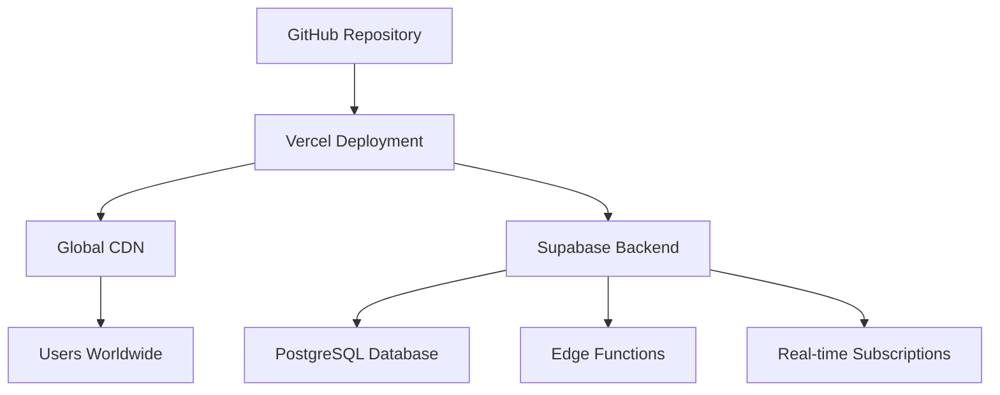

# 🌐 DEPLOYMENT & HOSTING STRATEGY

## DEPLOYMENT OPTIONS COMPARISON

### 1. GITHUB + VERCEL (RECOMMENDED) ⭐

#### Setup Process
```bash
# 1. Push to GitHub
git init
git add .
git commit -m "Initial complete trading system"
git branch -M main
git remote add origin https://github.com/yourusername/crypto-trading-system.git
git push -u origin main

# 2. Connect Vercel
# - Import from GitHub
# - Auto-deploys on push
# - Custom domain support
# - Edge functions included
```

#### Benefits
- **Cost**: Free tier generous, scales affordably
- **Performance**: Global CDN, edge computing
- **Integration**: Seamless GitHub integration
- **Scalability**: Automatic scaling
- **Security**: Built-in DDoS protection
- **Monitoring**: Comprehensive analytics

#### Monthly Costs
- **Hobby (Free)**: $0 - Perfect for development/testing
- **Pro**: $20/month - Production ready with analytics
- **Team**: $50/month - Multiple team members
- **Enterprise**: $400/month - Advanced security & support

### 2. NETLIFY ALTERNATIVE

#### Features
- **JAMstack Optimization**: Excellent for React apps
- **Form Submissions**: Built-in form handling
- **Split Testing**: A/B testing capabilities
- **Edge Functions**: Serverless computing
- **Analytics**: Traffic and performance insights

#### Pricing
- **Starter**: $0/month (100GB bandwidth)
- **Pro**: $19/month (1TB bandwidth)
- **Business**: $99/month (Premium features)

### 3. RAILWAY (FULL-STACK)

#### Advantages
- **Database Included**: PostgreSQL hosting
- **Supabase Integration**: Native support
- **Docker Support**: Container deployment
- **Environment Variables**: Secure config management
- **Monitoring**: Application performance tracking

#### Pricing
- **Developer**: $5/month (Basic resources)
- **Team**: $20/month (More resources)
- **Pro**: $100/month (Production workloads)

### 4. AWS AMPLIFY (ENTERPRISE)

#### Enterprise Features
- **Full AWS Integration**: S3, CloudFront, Lambda
- **Security**: WAF, Shield Advanced
- **Compliance**: SOC, HIPAA, PCI DSS
- **Monitoring**: CloudWatch integration
- **Scalability**: Unlimited scale potential

#### Pricing
- **Build & Deploy**: $0.01 per build minute
- **Hosting**: $0.15 per GB served
- **Typical Monthly**: $50-500 depending on traffic

## RECOMMENDED DEPLOYMENT STACK

### Primary Recommendation: GitHub + Vercel + Supabase



#### Setup Instructions

1. **Repository Setup**
```bash
# Create .env.local file
NEXT_PUBLIC_SUPABASE_URL=your_supabase_url
NEXT_PUBLIC_SUPABASE_ANON_KEY=your_anon_key
SUPABASE_SERVICE_ROLE_KEY=your_service_key
```

2. **Vercel Configuration**
```json
{
  "name": "crypto-trading-system",
  "version": 2,
  "builds": [
    {
      "src": "package.json",
      "use": "@vercel/static-build",
      "config": {
        "distDir": "dist"
      }
    }
  ],
  "env": {
    "NEXT_PUBLIC_SUPABASE_URL": "@supabase-url",
    "NEXT_PUBLIC_SUPABASE_ANON_KEY": "@supabase-anon-key"
  }
}
```

3. **GitHub Actions (CI/CD)**
```yaml
name: Deploy to Vercel
on:
  push:
    branches: [main]
jobs:
  deploy:
    runs-on: ubuntu-latest
    steps:
      - uses: actions/checkout@v2
      - name: Deploy to Vercel
        uses: amondnet/vercel-action@v20
        with:
          vercel-token: ${{ secrets.VERCEL_TOKEN }}
          vercel-org-id: ${{ secrets.ORG_ID }}
          vercel-project-id: ${{ secrets.PROJECT_ID }}
```

## CUSTOM DOMAIN SETUP

### Domain Configuration
```bash
# 1. Purchase domain (GoDaddy, Namecheap, Cloudflare)
# Recommended: crypto-ai-trader.com, smartcryptobot.io

# 2. Configure DNS in Vercel
# A Record: @ -> 76.76.19.19
# CNAME: www -> your-app.vercel.app

# 3. Enable SSL (Automatic with Vercel)
# Let's Encrypt certificate auto-renewal
```

### Subdomain Strategy
- **Main App**: app.yourdomain.com
- **Landing Page**: www.yourdomain.com
- **API Docs**: docs.yourdomain.com
- **Blog**: blog.yourdomain.com
- **Status Page**: status.yourdomain.com

## ENVIRONMENT MANAGEMENT

### Development Environments
```bash
# Local Development
ENVIRONMENT=development
DATABASE_URL=local_supabase_url
DEBUG_MODE=true

# Staging
ENVIRONMENT=staging  
DATABASE_URL=staging_supabase_url
DEBUG_MODE=false

# Production
ENVIRONMENT=production
DATABASE_URL=production_supabase_url
DEBUG_MODE=false
MONITORING_ENABLED=true
```

### Secret Management
```bash
# Vercel Environment Variables
OPENAI_API_KEY=your_openai_key
TWITTER_API_KEY=your_twitter_key
BINANCE_API_KEY=your_binance_key (for future)
STRIPE_SECRET_KEY=your_stripe_key (for payments)
```

## MONITORING & ANALYTICS

### Performance Monitoring
- **Vercel Analytics**: Built-in performance metrics
- **Sentry**: Error tracking and performance monitoring
- **LogRocket**: User session recordings
- **Uptime Robot**: 24/7 uptime monitoring

### Cost Monitoring
```bash
# Monthly Budget Estimates
Vercel Pro: $20/month
Supabase Pro: $25/month
Domain: $15/year
Monitoring Tools: $50/month
Total: ~$100/month for production
```

### Scaling Thresholds
- **Free Tier Limits**: 100GB bandwidth/month
- **Upgrade Triggers**: >50K monthly active users
- **Enterprise Migration**: >500K MAU or >$1M ARR

## BACKUP & DISASTER RECOVERY

### Database Backups
```sql
-- Automated Supabase backups (daily)
-- Point-in-time recovery available
-- Cross-region replication for enterprise
```

### Code Backup
```bash
# Multiple Git remotes for redundancy
git remote add github https://github.com/user/repo.git
git remote add gitlab https://gitlab.com/user/repo.git
git remote add bitbucket https://bitbucket.org/user/repo.git
```

### Recovery Procedures
1. **Database Recovery**: Supabase point-in-time restore
2. **Application Recovery**: Vercel rollback to previous deployment
3. **Data Recovery**: Multiple backup locations
4. **Communication**: Status page updates for users

## SECURITY IMPLEMENTATION

### SSL/TLS Configuration
- **Automatic HTTPS**: Vercel provides free SSL
- **HSTS Headers**: Force secure connections
- **CSP Headers**: Content Security Policy
- **Rate Limiting**: DDoS protection

### API Security
```typescript
// API route protection
export default async function handler(req: NextApiRequest, res: NextApiResponse) {
  // Rate limiting
  const rateLimit = await rateLimiter.check(req);
  if (!rateLimit.success) {
    return res.status(429).json({ error: 'Rate limit exceeded' });
  }
  
  // Authentication
  const token = req.headers.authorization;
  const user = await validateUser(token);
  if (!user) {
    return res.status(401).json({ error: 'Unauthorized' });
  }
  
  // Process request
}
```

## OPTIMIZATION STRATEGIES

### Performance Optimization
- **Code Splitting**: Lazy loading of components
- **Image Optimization**: Next.js automatic image optimization  
- **Caching**: Redis for session management
- **CDN**: Global content delivery

### Cost Optimization
- **Bundle Analysis**: Identify and remove unused code
- **Efficient Queries**: Optimize database queries
- **Caching Strategy**: Reduce API calls
- **Resource Monitoring**: Track usage patterns

## INTERNATIONAL DEPLOYMENT

### Multi-Region Strategy
```bash
# Primary Regions
US-East (Vercel): Primary deployment
EU-West (Vercel): European users
Asia-Pacific (Vercel): Asian markets

# Compliance Considerations
GDPR: EU data residency
CCPA: California privacy compliance
```

### Localization Preparation
- **i18n Setup**: Multi-language support ready
- **Currency Support**: Multiple fiat currencies
- **Time Zones**: User-specific time display
- **Legal Compliance**: Region-specific terms

This deployment strategy ensures scalable, secure, and cost-effective hosting while maintaining high performance globally.
